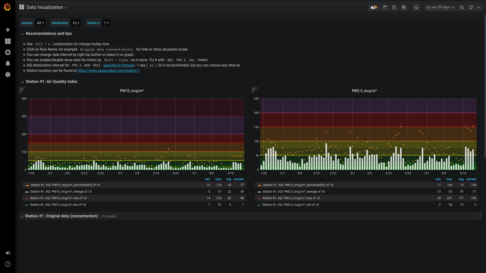
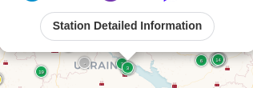
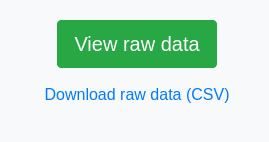

# Data visualizer from SaveEcoBot. Calculate AQI

>**[Читати Українською :ukraine:](README-uk.md)**

This software sets up and runs a nice dashboard with metrics from the CSV file and calculate AQI for PM2.5 and PM10.

Air Quality Index calculations are based on [this document](https://www.airnow.gov/sites/default/files/2018-05/aqi-technical-assistance-document-may2016.pdf).



More screenshots and usage examples [here](docs/en/screenshots.md).

---

## MENU <!-- omit in toc -->

* [Required software](#required-software)
* [Usage](#usage)
  * [Quick start](#quick-start)
  * [Daily usage](#daily-usage)
    * [Start](#start)
    * [Stop](#stop)
  * [Sensors data](#sensors-data)
    * [Process new data](#process-new-data)
    * [Add new data](#add-new-data)
    * [Remove data](#remove-data)
  * [Full cleanup](#full-cleanup)
* [For contributors](#for-contributors)
* [Future plans](#future-plans)
* [Want help?](#want-help)
* [License and Copyrights](#license-and-copyrights)

---

## Required software

* [`Docker`](https://docs.docker.com/get-docker/)
* [`docker-compose`](https://docs.docker.com/compose/install/) (for Linux)

## Usage

### Quick start

1. Clone this repo

```bash
git clone git@github.com:MaxymVlasov/eco-data-visualizer.git
```

or [download it as zip](https://github.com/MaxymVlasov/eco-data-visualizer/archive/master.zip) and unpack.

2. Choose SaveEcoBot station [on this map](https://www.saveecobot.com/en/maps) and click 'Details'  


3. On the bottom you'll see `Download raw data (CSV)`  
  
click on the link and save CSV-file to `./data/original_data/` inside downloaded repo.

4. Open the terminal in the root of `eco-data-visualizer` and run:

```bash
# Data preparation
docker build -t data-transformer ./data-transformer-app
docker run -v "$PWD"/data/:/app/data/ --rm data-transformer
# Run Grafana and DBs
docker-compose up -d
# Add data of sensors to InfluxDB
docker build -t add_influx_data ./provisioning/influx
docker run -v "$PWD"/data/influx/:/influx-data/ --rm --network=eco-data-visualizer_default add_influx_data
```
<!-- markdownlint-disable no-inline-html -->
><sup>Depending on your internet bandwidth, CPU, Storage I/O, CSV file size, and the number of processed files `First Init` may take different times.  
For example, in laptop with `100Mbit/s` bandwidth, `Intel Core i7-8550U` (max clock speed `4Ghz`), SSD disk and:</sup>  
<sup>  - 2 CSV files (together: 620MB) it takes `8m11s` (`6m09s` to transform data)</sup>  
<sup>  - 1 CSV file (513MB) - `5m27s` (`3m47s` to transform data)</sup>  
<sup>  - 1 CSV file (107MB) - `3m42s` (`2m` to transform data)</sup>
<!-- markdownlint-enable no-inline-html -->

5. Open [http://localhost/](http://localhost/) for see visualizations!

### Daily usage

#### Start

To start visualization open terminal in the root of the repo and run:

```bash
docker-compose up -d
```

Then open [http://localhost/](http://localhost/) to see visualizations.

#### Stop

To stop visualization open terminal in the root of the repo and run:

```bash
docker-compose stop
```

### Sensors data

#### Process new data

1. Download CSV file from SaveEcoBot station
2. Move it to `data/original_data` folder in the repo.
3. Run:

```bash
# Remove temporary files
docker run -v "$PWD"/data/:/app/ --rm amancevice/pandas:1.0.3-alpine sh -c "rm -f /app/csv/*.csv /app/influx/*.influx"
# Data preparation
docker build -t data-transformer ./data-transformer-app
docker run -v "$PWD"/data/:/app/data/ --rm data-transformer
```

#### Add new data

To add new data, open terminal in the root of the repo and run:

```bash
# Start services
docker-compose up -d
# Add new data
docker build -t add_influx_data ./provisioning/influx
docker run -v "$PWD"/data/influx/:/influx-data/ --rm --network=eco-data-visualizer_default add_influx_data
```

#### Remove data

To remove sensors data, open terminal in the root of the repo and run:

```bash
docker-compose down
docker volume rm eco-data-visualizer_sensors-data
```

### Full cleanup

To clean up, open terminal in the root of the repo and run:

```bash
# Stop services
docker-compose down
# Remove volumes with settings and sensors data
docker volume rm eco-data-visualizer_grafana-settings eco-data-visualizer_sensors-data
# Remove temporary files
docker run -v "$PWD"/data/:/app/ --rm amancevice/pandas:1.0.3-alpine sh -c "rm -f /app/csv/*.csv /app/influx/*.influx"
```

## For contributors

Use same instructions as in [Quick start](#quick-start) section but in step 4 add `--build-arg ENV=dev` to `data-transformer-app`.

```bash
docker build --build-arg ENV=dev -t data-transformer ./data-transformer-app
```

## Future plans

* [ ] Add Ukrainian localization
  * [ ] Code and message dashboard localization
  * [ ] Docs localization
* [ ] In Grafana Create personal graphs for each sensor with own good-bad color limits and so on as for AQI
* [ ] Grab exist metrics from 'phenomenon' colum, use `SENSORS` content only for user friendly names and localization
* [ ] Add AQI support for everything specified in [the doc](https://www.airnow.gov/sites/default/files/2018-05/aqi-technical-assistance-document-may2016.pdf)
* [ ] Optimize `data-transformer-app`
  * [ ] Parallel sensors operation execution
  * [x] Use less Disk I/O operations

<!-- markdownlint-disable no-trailing-punctuation -->
## Want to help?
<!-- markdownlint-enable no-trailing-punctuation -->

You can:

* Improve this software (see [Future plans](#future-plans-) section).
* [Donate to SaveEcoBot](https://www.saveecobot.com/en/donate).
* Assemble or buy Air quality monitoring station and connect it to SaveEcoBot. SaveDnipro can assemble and connect it for you. [Buy here](https://www.savednipro.org/product/stanciya-monitoringu-yakosti-povitrya/).

## License and Copyrights

This software is licensed by [Apache License 2.0](LICENSE).

All data from SaveEcoBot is licensed by [Creative Commons Attribution License 4.0 International](https://creativecommons.org/licenses/by/4.0/legalcode).

Other data and sources can be licensed in a different way.
